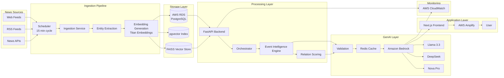
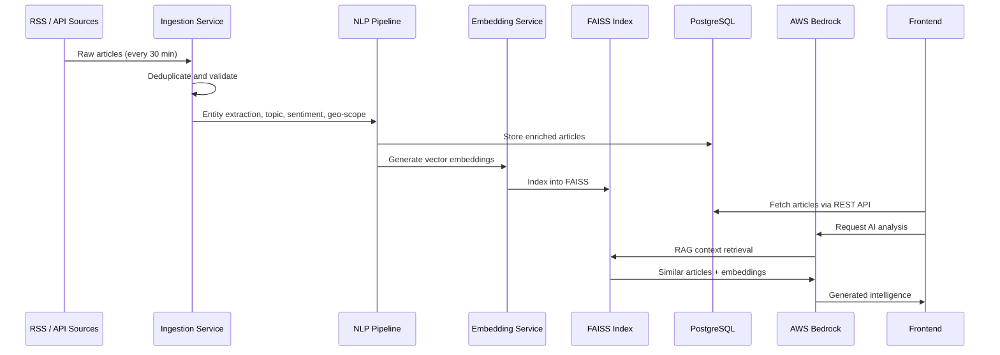
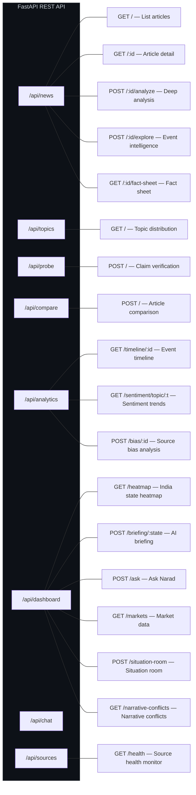

# Narad — News Intelligence Platform v2.0

Narad is a production-grade, multilingual event intelligence system built for the Indian news ecosystem. It ingests articles from **80+ sources** across **10+ Indian languages**, processes them through deterministic NLP pipelines, and surfaces AI-driven intelligence using AWS Bedrock LLMs. The platform provides real-time claim verification, narrative conflict detection, causal chain analysis, and state-level sentiment mapping.

## Project Overview

The system operates on a **dual-plane architecture**: a FastAPI backend manages ingestion, NLP processing, vector indexing, and LLM orchestration, while a Next.js frontend delivers the India Command Center, Probe verification tool, analytics dashboards, and conversational Q&A interface. Background ingestion runs on a 30-minute APScheduler cycle. All AI inference is performed through AWS Bedrock with three model tiers.

## System Architecture

The platform follows a layered pipeline architecture where raw articles flow through ingestion, storage, processing, GenAI inference, and finally surface through the application layer.



## Data Flow

Articles are ingested on a 30-minute cycle, deduplicated, enriched through the full NLP pipeline, embedded into FAISS, and stored in PostgreSQL. Frontend requests trigger real-time LLM analysis via RAG retrieval over the indexed corpus.



## Intelligence Modules

| Module | Function | Backing Model |
|---|---|---|
| Ask Narad | Conversational RAG Q&A over entire corpus | Llama 3.3 70B |
| Situation Room | State-level AI briefings with threat assessment | Llama 3.3 70B |
| Narrative Conflicts | Detect opposing coverage across sources | DeepSeek |
| Cross-Validation | Verify claims against multi-source evidence | DeepSeek |
| Event Intelligence | Explore causal chains across story domains | Llama 3.3 70B |
| Fact Sheets | Multi-source aggregated fact reports | Llama 3.3 70B |
| Probe | Paste any claim, get credibility-scored matches | Embedding + Scoring |
| Source Bias | Compare sentiment divergence across outlets | Embedding + Scoring |

## API Route Map



## Frontend Views

| View | Route | Purpose |
|---|---|---|
| India Today | `/` | Live article feed with real-time polling |
| India Command Center | `/india` | State heatmap, AI briefings, market data, domain radar |
| Global | `/global` | International news aggregation |
| Topics | `/topics` | Topic-wise article explorer |
| Probe | `/probe` | Paste-and-verify claim validation |
| Article Detail | `/article/:id` | Full article with analytics panels |

## System Specifications

| Category | Specification |
|---|---|
| Backend Framework | FastAPI + Uvicorn (async) |
| Frontend Framework | Next.js 16, React 19, TypeScript |
| AI / LLM Backend | AWS Bedrock (Llama 3.3 70B, DeepSeek, Nova Pro) |
| NLP Engine | spaCy + sentence-transformers (MiniLM-L12) |
| Vector Search | FAISS CPU + pgvector |
| Database | PostgreSQL (async via SQLAlchemy + asyncpg) |
| Caching | Redis |
| Ingestion | feedparser, httpx, trafilatura |
| Scheduling | APScheduler (30-minute cycles) |
| Styling | Tailwind CSS v4 + Framer Motion |
| Containerization | Docker |
| Deployment | AWS Amplify + S3 |

## Deployment

### Backend

```bash
cd backend

# Create virtual environment
python -m venv venv
source venv/bin/activate

# Install dependencies
pip install -r requirements.txt
python -m spacy download en_core_web_sm

# Configure environment
cp .env.example .env
# Edit: DATABASE_URL, AWS credentials, REDIS_URL

# Start server
uvicorn app.main:app --reload --port 8000
```

### Frontend

```bash
cd frontend

# Install dependencies
npm install --legacy-peer-deps

# Start dev server
npm run dev
```

Frontend runs at `http://localhost:3000`. Backend runs at `http://localhost:8000`.

### Environment Variables

| Variable | Description | Default |
|---|---|---|
| `DATABASE_URL` | PostgreSQL async connection string | `postgresql+asyncpg://...@localhost/narad` |
| `STORAGE_BACKEND` | Article storage — `local` or `s3` | `local` |
| `LLM_BACKEND` | LLM provider — `mock` or `bedrock` | `bedrock` |
| `EMBEDDING_BACKEND` | Embedding provider — `local` or `titan` | `local` |
| `AWS_REGION` | AWS region for Bedrock | `us-east-1` |
| `NEWS_API_KEY` | NewsAPI key (optional) | — |
| `REDIS_URL` | Redis connection URL (optional) | — |

## Project Structure

```
Narad/
├── backend/
│   ├── app/
│   │   ├── main.py                  # FastAPI entry + lifespan + rate limiter
│   │   ├── config.py                # Pydantic settings from .env
│   │   ├── database.py              # SQLAlchemy async engine
│   │   ├── sources.py               # 80+ source definitions
│   │   ├── models/
│   │   │   ├── article.py           # Article ORM model
│   │   │   └── schemas.py           # Request/response schemas
│   │   ├── routes/
│   │   │   ├── news_routes.py       # Article CRUD + analysis
│   │   │   ├── dashboard_routes.py  # India Command Center
│   │   │   ├── analytics_routes.py  # Timeline, sentiment, bias
│   │   │   ├── probe_routes.py      # Claim verification
│   │   │   ├── compare_routes.py    # Article comparison
│   │   │   ├── chain_routes.py      # Causal chains
│   │   │   ├── chat_routes.py       # Ask Narad
│   │   │   └── source_routes.py     # Source health
│   │   └── services/
│   │       ├── orchestrator.py              # Central coordination
│   │       ├── ingestion_service.py         # RSS / API ingestion
│   │       ├── llm_service.py               # AWS Bedrock integration
│   │       ├── embedding_service.py         # Vector embeddings
│   │       ├── entity_service.py            # Named entity extraction
│   │       ├── clustering_service.py        # Article clustering
│   │       ├── scoring_service.py           # Relation scoring
│   │       ├── causal_chain_service.py      # Causal chain analysis
│   │       ├── event_intelligence_service.py # Event exploration
│   │       ├── fact_sheet_service.py        # Multi-source fact sheets
│   │       ├── topic_classifier.py          # Topic classification
│   │       ├── sentiment_service.py         # Sentiment analysis
│   │       ├── geo_scope_classifier.py      # Geographic classification
│   │       ├── page_index_rag.py            # RAG pipeline
│   │       ├── cache_service.py             # Redis caching
│   │       └── storage_service.py           # S3 / local storage
│   ├── requirements.txt
│   └── Dockerfile
├── frontend/
│   ├── app/
│   │   ├── page.tsx                 # Home feed — India Today
│   │   ├── layout.tsx               # Root layout
│   │   ├── globals.css              # Design system tokens
│   │   ├── lib/api.ts               # Typed API client
│   │   ├── components/
│   │   │   ├── Navbar.tsx           # Navigation + language selector
│   │   │   ├── ArticleCard.tsx      # Article display card
│   │   │   ├── AnalyticsPanels.tsx  # Analytics dashboard panels
│   │   │   ├── SearchOverlay.tsx    # Global search overlay
│   │   │   └── ConnectionPulse.tsx  # Event connection visualization
│   │   ├── article/                 # Article detail page
│   │   ├── india/                   # India Command Center
│   │   ├── global/                  # Global news view
│   │   ├── topics/                  # Topic explorer
│   │   └── probe/                   # Claim verification
│   ├── package.json
│   └── Dockerfile
└── amplify.yml                      # AWS Amplify deployment config
```

## Language Coverage

| Language | ISO Code | Sources |
|---|---|---|
| English | `en` | Times of India, NDTV, Indian Express, Hindustan Times, The Hindu, Scroll, LiveMint, etc. |
| Hindi | `hi` | Dainik Jagran, Amar Ujala, NDTV Hindi, BBC Hindi, Navbharat Times, etc. |
| Tamil | `ta` | The Hindu Tamil, Dinamalar, Dinamani, Vikatan, Tamil Guardian |
| Telugu | `te` | Eenadu, Sakshi, TV9 Telugu, Telugu360, Andhrajyothy |
| Bengali | `bn` | Anandabazar Patrika, Bartaman, Pratidin, Sangbad Pratidin |
| Marathi | `mr` | Loksatta, Maharashtra Times, eSakal, Lokmat |
| Gujarati | `gu` | Gujarat Samachar, Divya Bhaskar, Sandesh |
| Kannada | `kn` | Vijaya Karnataka, Prajavani, Udayavani, Kannada Prabha |
| Malayalam | `ml` | Mathrubhumi, Manorama, Deshabhimani, Madhyamam |
| Urdu | `ur` | Inquilab, Munsif Daily, Siasat |

## Monitoring

Health check endpoint:

```bash
curl http://localhost:8000/health
```

Source health dashboard:

```bash
curl http://localhost:8000/api/sources/health
```

---

Built for the **AWS AI for Bharat Hackathon**.

Named after **Narad Muni** — the divine messenger in Hindu mythology who travels across realms carrying news and wisdom.
